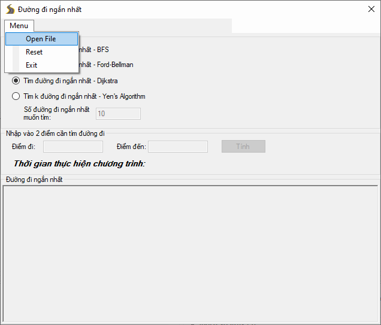
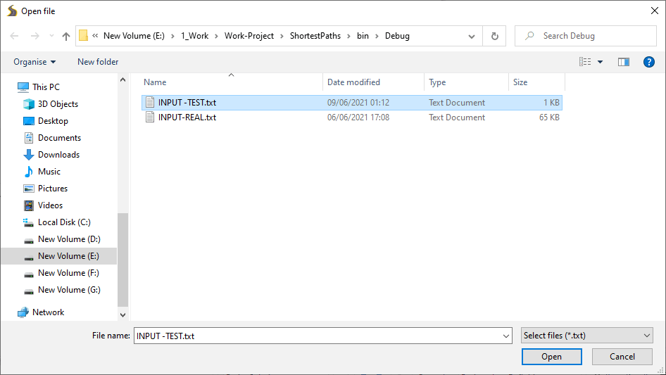
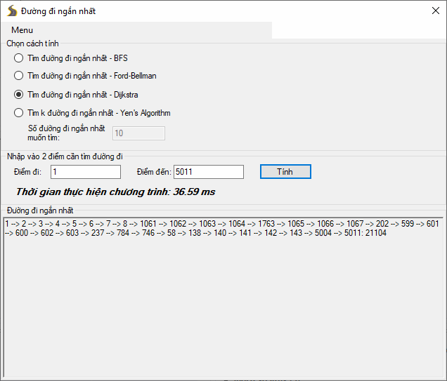
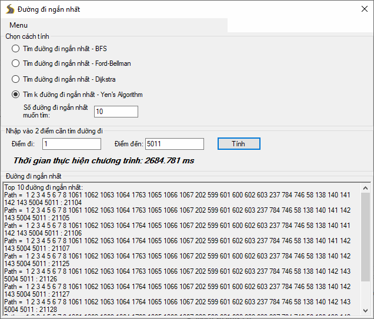

# ShortestPaths - Chương trình tìm đường đi ngắn nhất (k đường đi ngắn nhất)

## Hướng dẫn sử dụng

### 1. Vào Menu --> Open File 

### 2. Chọn file txt (file được để sẵn trong thư mục bin/Debug)

### 3. Chọn cách tính --> Tính

## Công nghệ sử dụng

- Winforms (.NET Framework 4.5)

## Ngôn ngữ sử dụng

- C#

